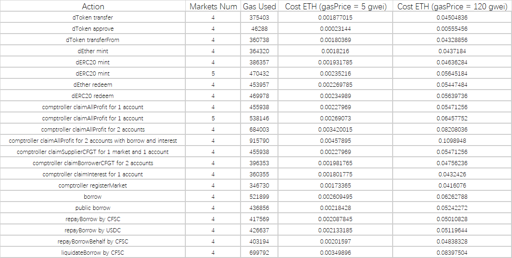

# cycle-contracts

solidity implementation of cycle finance protocol

## TODO List

- clear code
- optimize gas consumed
- use SafeERC20 library of openzepplin

## Gas Used

> note: In the case of 20 gwei gas price, contract deployment and initialization cost 0.43614694 ETH

## Deployment

### BSC Testnet

| Contract | Address |
| --- | --- |
| Oracle | 0x9F8A69225E660326aE12D245895b5a62D6ddeBBA |
| TestWBTC | 0x41187165EBFb224e7071d6430B37B614cE1313dC |
| TestUSDC | 0x9fA83A655bA546a14fe21E5CA3A28340f7adB304 |
| TestUSDT | 0x8CEBa6b1f72a0029BF3D1E26104334B5b5E5da2D |
| SimpleInterestRateModel | 0x5056BBA76AD14579866342c0Ff16C7aeb2A6D224 |
| ExchangePool | 0xF7e8da9Fc44B7003b276BB3a346E6B0982D13E10 |
| CycleStableCoin | 0x3371a3FE20cd84Aba87a1B6695582cBC8D505F9F |
| CycleToken | 0xe6Bfb7671eF5eFB2715bF442c69Fb8E90a70EF57 |
| Comptroller | 0x9476170ea04433A06bf36e6347F3A3E3b90dAbd3 |
| Borrows | 0xc17D638e4E9a2a9Abfdf489893175e90A605E267 |
| DEther | 0xCE45067070BfF69bD1AA18453EE9fBE314173C42 |
| DERC20 | 0xe7347882E6fEc8AFeDA238b155250d8aD6248b6D |
| ComptrollerProxy | 0xe4dA44B2619B9e59799B2a16f2eF0b0362b56802 |
| BorrowsProxy | 0xC41e11815D8D8960d9E5788f35bA15295ec12F0d |
| DEtherProxy | 0x53551542D5AdD0092E49B0d473CdB877898Ecf8D |
| DWBTCProxy | 0xEbe728ACe08626204E89017B63BC2d0BbD00C8eC |
| DUSDCProxy | 0x9518CA7d80aB251442F6d2d89211193D9064Bd32 |
| DUSDTProxy | 0xFfD20CB8da64D64013C2c04a5b15018CeC4af7Ce |